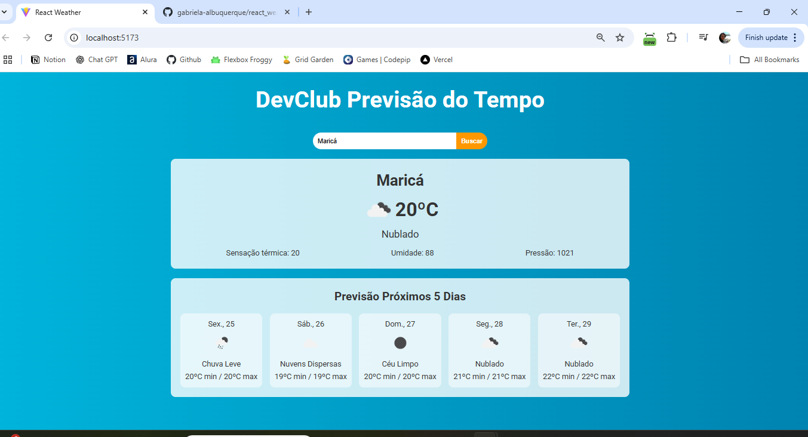

# React Weather 🌤️

Projeto desenvolvido com **React** para exibição do clima atual e previsão dos próximos 5 dias, com base na cidade informada pelo usuário. As informações são obtidas em tempo real por meio da **API da OpenWeather**.

## 🔎 Funcionalidades

- Busca de cidade digitada pelo usuário
- Exibição da temperatura atual, sensação térmica, umidade e pressão
- Previsão para os próximos 5 dias, com temperatura mínima e máxima e descrição do tempo
- Interface responsiva e limpa, com ícones condizentes com as condições meteorológicas

## ⚙️ Tecnologias e conceitos aplicados

| Tecnologia          | Conceitos aplicados                                                            |
| ------------------- | ------------------------------------------------------------------------------ |
| **React**           | Componentização, Props, Hooks (`useState`, `useRef`), renderização condicional |
| **Axios**           | Requisições HTTP para API externa                                              |
| **OpenWeather API** | Consumo de dados climáticos em tempo real                                      |
| **JavaScript**      | Manipulação de datas, arrays e objetos aninhados                               |
| **CSS**             | Estilização modular por componente                                             |

## 📌 O que este projeto demonstra

- **Integração com APIs externas** e manipulação dos dados recebidos
- **Boas práticas com React**: componentes reutilizáveis, legibilidade e organização
- **Gerenciamento de estado local** com hooks
- **Renderização dinâmica baseada em dados externos**
- **Tratamento e exibição de listas** (como a previsão dos próximos dias)
- **Formatação de datas** com `toLocaleDateString`
